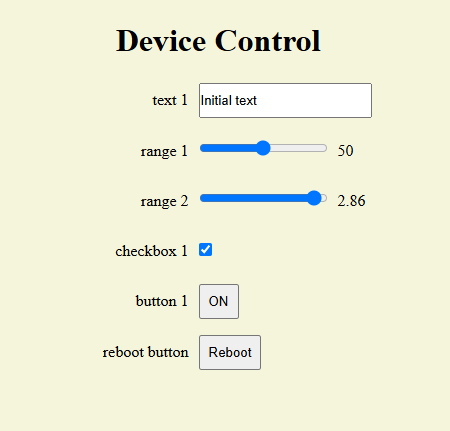
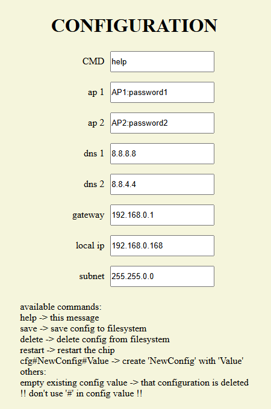
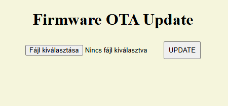

# ESPAsyncWebControl

This library simplifies creating web interfaces for ESP32 and ESP8266-based devices. It allows easy integration of configuration pages, control panels, and firmware update functionalities.

## Features

*   **AsyncWebConfig:** Manages configuration options via a web interface.
*   **AsyncWebControl:** Creates interactive control panels with various elements (text fields, sliders, checkboxes, buttons).
*   **AsyncWebUpdate:** Provides firmware update capability through a web interface.
*   WebSocket-based communication for real-time updates.
*   Basic authentication (username/password).

## Installation

1.  Download the library as a ZIP file.
2.  Open the Arduino IDE.
3.  Go to "Sketch" -> "Include Library" -> "Add .ZIP Library...".
4.  Select the downloaded ZIP file.

## Usage

### AsyncWebControl

```c++
#include <Arduino.h>
#include <ESPAsyncWebServer.h>
#include <ESPAsyncWebControl.h>

AsyncWebServer server(80);
AsyncWebControl webControl;

void setup() {
    // ... Serial setup ....
    // ... WiFi connection ...

    webControl.addTitle("Device Control");
    webControl.addText("text 1", "Initial text", [](const String value) {
        Serial.println("text 1 = " + value);
        webControl.msg("text 1 = " + value);
        });
    webControl.addRange("range 1", 50, 0, 100, 1, [](const String value) {
        Serial.println("range 1 = " + value);
        webControl.msg("range 1 = " + value);
        });
    webControl.addRange("range 2", 2.5f, -3.14f, 3.14f, 0.01f, [](const String value) {
        Serial.println("range 2 = " + value);
        webControl.msg("range 2 = " + value);
        });
    webControl.addCheckbox("checkbox 1", true, [](const String value) {
        Serial.println("checkbox 1 = " + value);
        webControl.msg("checkbox 1 = " + value);
        });
    webControl.addButton("button 1", "ON", [](const String value) {
        Serial.println("button 1 = " + value);
        webControl.msg("button 1 = " + value);
        webControl.set("button 1", value == "OFF" ? "ON" : "OFF");
        });
    webControl.addButton("reboot button", "Reboot", [](const String value) {
        ESP.restart();
        });

    webControl.begin(&server); //webControl.begin(&server, "/control", "admin", "password");

    server.on("/", HTTP_GET, [&](AsyncWebServerRequest* request) {
        request->redirect("/control");
        });

    server.begin();
}

void loop() {}
```

## Screenshots based on the "complex" example







---

### If you want to cheer me up with a coffee:
<a href="https://www.buymeacoffee.com/jzolee" target="_blank"></a>
